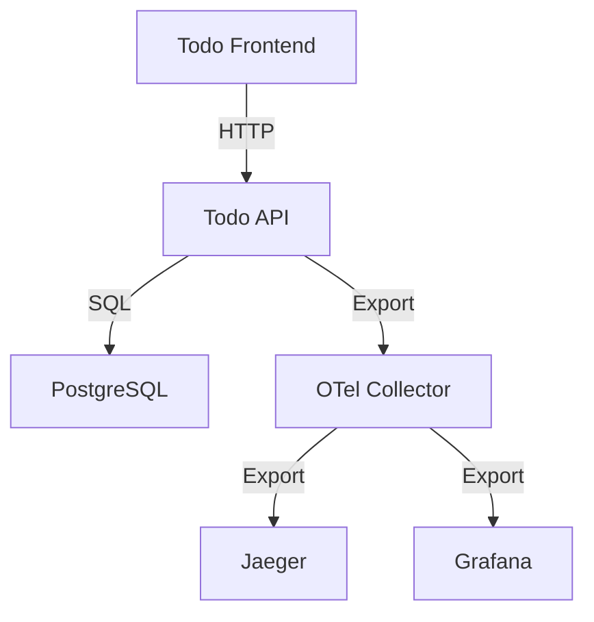

# OpenTelemetry 学習のための Todo アプリケーション

## プロジェクトの概要

このプロジェクトは、OpenTelemetry の実践的な学習を目的とした、.NET 6 を使用した Todo アプリケーションです。
シンプルな CRUD 操作を通じて、OpenTelemetry の基本概念から実装まで、段階的に学習できる環境を提供します。

### 学習目標

1. OpenTelemetry の基本概念の理解

   - Traces, Metrics, Logs の概念
   - Context Propagation の仕組み
   - Sampling 戦略の理解

2. .NET 6 での OpenTelemetry 実装

   - 自動計装（Auto-instrumentation）の活用
   - カスタム Span の作成と属性の追加
   - メトリクスの収集と可視化
   - 分散トレーシングの実装

3. 可観測性（Observability）の実践
   - Jaeger によるトレース可視化
   - Grafana によるメトリクス監視
   - OpenTelemetry Collector の設定と活用

## システム構成

### アプリケーションアーキテクチャ



### 技術スタック

- **アプリケーション**

  - .NET 6 Web API
  - Entity Framework Core
  - PostgreSQL 15
  - 最小限の React フロントエンド

- **観測環境**

  - OpenTelemetry SDK
  - OpenTelemetry Collector
  - Jaeger
  - Grafana

- **開発環境**
  - Dev Container（純粋な.NET 6 環境）
  - Tilt（ローカル開発環境のオーケストレーション）
  - Docker Compose

## 学習ステップ

### 第 1 章：環境構築と Todo アプリの基本実装

- Dev Container 環境の構築
- .NET 6 WebAPI プロジェクトの作成
- Entity Framework を使用した CRUD 実装
- 動作確認用の最小限の UI 実装

### 第 2 章：OpenTelemetry の導入

- OpenTelemetry SDK の統合
- 自動計装の設定
- カスタム Span の実装
- メトリクスの追加

### 第 3 章：観測環境の構築

- OpenTelemetry Collector の設定
- Jaeger の統合
- Grafana のダッシュボード設定
- 分散トレーシングの確認

### 第 4 章：高度な機能と運用

- Sampling 設定の最適化
- カスタムメトリクスの追加
- エラー処理の改善
- パフォーマンス分析

## 学習の進め方

1. 各章は以下のサイクルで進めます：

   - 資料の読み込み
   - 実装演習
   - 動作確認
   - 質疑応答
   - コードレビューと講評
   - 学習内容のコミット（git に履歴を残す）

2. 講師（AI）は以下のサポートを提供：

   - 実装手順の解説
   - 参考資料の提供（RFC、公式ドキュメント等）
   - 質問への回答
   - コードレビューと改善提案

3. 進捗管理：
   - 各章での学習目標の達成確認
   - 実装の品質チェック
   - 理解度の確認質問
   - フィードバックの収集

## 注意事項

- このプロジェクトは学習用であり、プロダクション利用は想定していません
- コードの可読性を重視し、複雑な実装は避けます
- UI は機能確認用の最小限の実装とします
- OpenTelemetry の実装も説明用に必要最小限とします

## 参考資料

- [OpenTelemetry 公式ドキュメント](https://opentelemetry.io/docs/)
- [.NET 用 OpenTelemetry SDK](https://github.com/open-telemetry/opentelemetry-dotnet)
- [OpenTelemetry Collector](https://opentelemetry.io/docs/collector/)
- [OpenTelemetry 仕様](https://github.com/open-telemetry/opentelemetry-specification)

## ライセンス

MIT

## ハンズオン完了後の資料管理

このリポジトリは、複数の学習者が同じ内容を学べるよう以下の方針で管理されます：

### ブランチ管理

- `main`: 初期状態のブランチ（ハンズオン開始時の状態）
- `chapters/*`: 各章の完了状態を保存
- `solutions`: 完成形のリファレンス実装
- `your-work`: あなたの作業用ブランチ

### ディレクトリ構成と使用方法

```
.
├── docs/           # 学習テキストと解説
│   ├── chapters/   # 章ごとの学習資料
│   │   ├── 01_setup/      # 第1章の解説
│   │   ├── 02_otel/       # 第2章の解説
│   │   └── ...
│   └── solutions/  # 解答例と詳細な説明
├── src/            # ソースコード
│   ├── start/      # 学習開始時のベースコード
│   │   ├── TodoApi/       # APIプロジェクト
│   │   ├── TodoWeb/       # フロントエンドプロジェクト
│   │   └── docker/        # 開発環境の定義
│   └── complete/   # 完成形の実装例（参考用）
└── exercises/      # 章ごとの演習
    ├── 01_setup/   # 第1章の演習
    ├── 02_otel/    # 第2章の演習
    └── ...
```

### 学習の開始方法

1. このリポジトリをフォーク
2. `your-work`ブランチを作成
3. `src/start`のコードをあなたのワークスペースにコピー
4. 各章の手順に従って実装:
   - `docs/chapters/XX_chapter`の解説を読む
   - `exercises/XX_chapter`の課題に取り組む
   - 必要に応じて`src/complete`の実装例を参照
   - 講師（AI）のレビューを受ける
5. 完了した実装を`your-work`ブランチにコミット

### コードの構成

- **src/start**:

  - 最小限の機能を持つベースとなる Todo アプリ
  - OpenTelemetry 実装前の状態
  - すぐに動作確認できる状態で提供

- **exercises**:

  - 各章で達成すべき具体的な課題
  - 段階的な難易度設定
  - 動作確認方法の説明
  - トラブルシューティングのヒント

- **src/complete**:
  - 全ての演習を完了した理想的な実装例
  - コードにはコメントで実装意図を説明
  - 本番環境での利用を想定した実装例

### 講師（AI）プロンプト

- `docs/prompts/`に講師役の AI の振る舞いを定義
- 各章の目標に応じた適切なレビューと指導
- 理解度の確認と追加の説明提供

## 貢献について

プルリクエストや提案は歓迎します。ただし、以下の点に注意してください：

- 学習目的のシンプルさを維持すること
- コードの可読性を重視すること
- 十分なドキュメントを含めること
- 再利用可能な形での資料整備を心がけること
