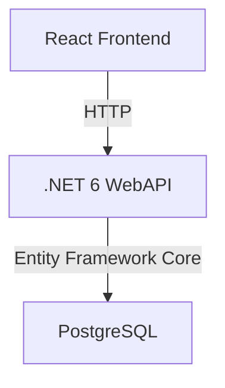

# 第1章: 環境構築とTodoアプリの基本実装

本章では、OpenTelemetryを学習するための基盤となるTodoアプリケーションの構築手順を解説します。

## 目次

1. [開発環境のセットアップ](./01_environment_setup.md)
   - Dev Container環境の構築
   - 必要なツールのインストール
   - プロジェクト構成の作成

2. [バックエンドAPIの実装](./02_backend_implementation.md)
   - .NET 6 WebAPIプロジェクトの作成
   - Entity Framework Coreの設定
   - TodoItemモデルとDBコンテキストの実装
   - CRUDエンドポイントの実装

3. [フロントエンドの実装](./03_frontend_implementation.md)
   - Reactアプリケーションの作成
   - 必要なパッケージのインストール
   - コンポーネントの実装
   - APIクライアントの実装

4. [動作確認とトラブルシューティング](./04_testing_and_troubleshooting.md)
   - 環境の起動確認
   - APIエンドポイントのテスト
   - フロントエンドの動作確認
   - 一般的な問題と解決方法

## 前提条件

- Visual Studio Code
- Docker Desktop
- Git

## 成果物

本章の実装により、以下の機能を持つTodoアプリケーションが完成します：

- Todoアイテムの作成
- Todoリストの表示
- Todoアイテムの完了状態の切り替え
- Todoアイテムの削除

## アーキテクチャ概要

## 技術スタック

### バックエンド
- .NET 6
- Entity Framework Core
- PostgreSQL

### フロントエンド
- React
- TypeScript
- Material-UI
- Axios

### 開発環境
- Dev Container
- Docker Compose
