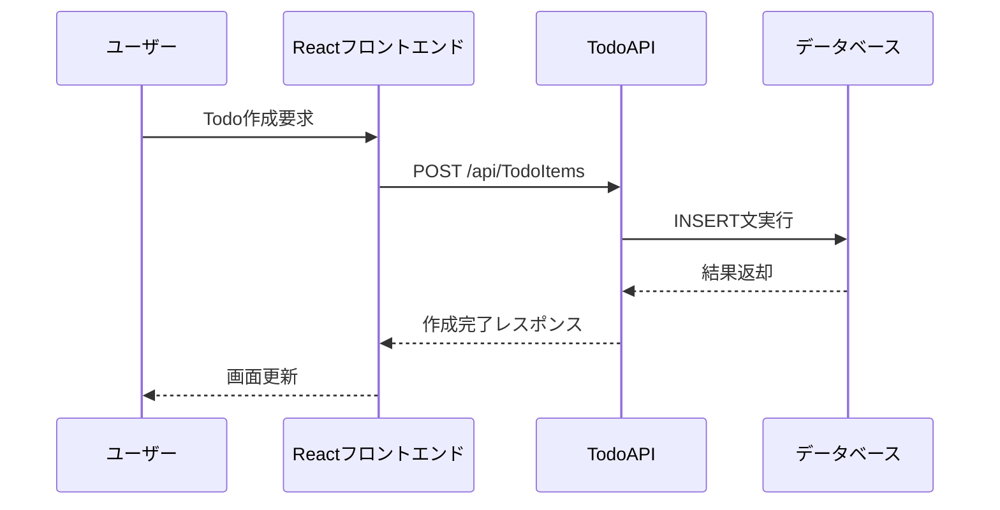
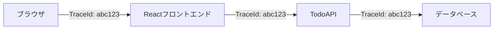

# OpenTelemetryの基本

## OpenTelemetryとは

OpenTelemetryは、分散システムの可観測性を実現するためのオープンソースプロジェクトです。アプリケーションの振る舞いを理解し、問題を特定・解決するために必要な情報を収集・分析する機能を提供します。

## 主要コンポーネント

### 1. トレース (Traces)

トレースは、分散システム内でのリクエストの流れを追跡するものです。

#### Todoアプリケーションでの例



- トレースIDによって一連の処理を追跡
- SpanでAPIリクエストやDB操作などの個別の処理を記録
- 処理時間や例外情報も記録

### 2. メトリクス (Metrics)

メトリクスは、システムの状態や振る舞いを数値で表したものです。

#### Todoアプリケーションでのメトリクス例

1. カウンター (Counter)
   - Todo作成回数
   - Todo完了回数
   - APIリクエスト数

2. ゲージ (Gauge)
   - アクティブなTodoの数
   - 処理中のリクエスト数

3. ヒストグラム (Histogram)
   - Todo完了までの時間分布
   - APIレスポンスタイムの分布

### 3. ログ (Logs)

ログは、システム内で発生したイベントの詳細な記録です。

#### Todoアプリケーションでのログ例

```json
{
  "timestamp": "2025-04-25T17:11:56Z",
  "level": "Information",
  "event": "TodoCreated",
  "traceId": "abcd1234...",
  "spanId": "efgh5678...",
  "data": {
    "todoId": 1,
    "title": "OpenTelemetryを学習する",
    "userId": "user123"
  }
}
```

## Context Propagation（コンテキスト伝搬）

### 概要

分散システムでは、1つのリクエストが複数のサービスを経由します。Context Propagationは、これらのサービス間でトレース情報を伝搬する仕組みです。

### Todoアプリケーションでの例



- W3C Trace Contextヘッダーを使用してトレース情報を伝搬
- サービス間で一貫したトレーシングを実現

## Sampling（サンプリング）

### 概要

全てのリクエストを記録するとコストが高くなるため、サンプリングによって記録する対象を制御します。

### サンプリング戦略

1. ヘッドベースサンプリング
   - リクエストの開始時点で記録するかを決定
   - 例：10%のリクエストのみを記録

2. テールベースサンプリング
   - リクエストの完了時点で記録するかを決定
   - 例：エラーが発生したリクエストは必ず記録

### Todoアプリケーションでのサンプリング例

```csharp
services.AddOpenTelemetry()
    .WithTracing(builder => builder
        .SetSampler(new TraceIdRatioBasedSampler(0.1)) // 10%をサンプリング
        .AddSource("TodoApi")
        // ...その他の設定
    );
```

## まとめ

OpenTelemetryの基本コンポーネント：

1. トレース
   - リクエストの流れを追跡
   - 処理時間や例外を記録
   - サービス間の依存関係を可視化

2. メトリクス
   - システムの状態を数値化
   - 傾向分析やアラート設定に活用
   - パフォーマンス監視の基盤

3. ログ
   - 詳細なイベント情報を記録
   - トレース情報と紐付け
   - トラブルシューティングに活用

## 次のステップ

次章では、これらの概念を実際のコードとして実装していきます。OpenTelemetry SDKのインストールと基本設定から始めていきましょう。
