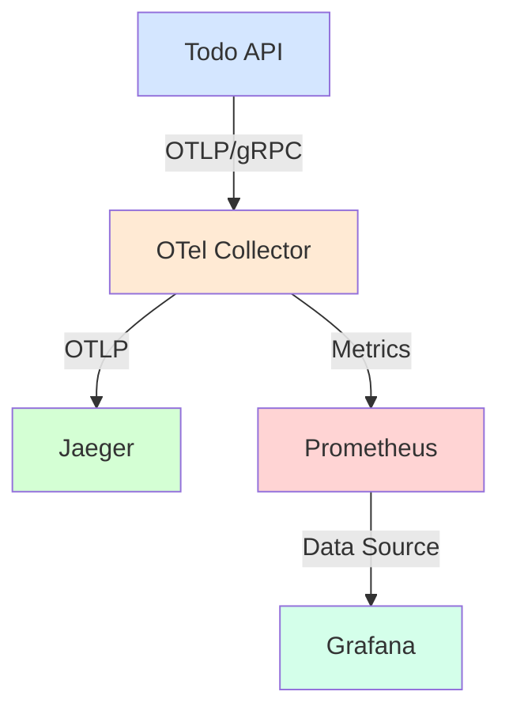

# 観測環境のセットアップ

## 概要

この章では、OpenTelemetryで収集したデータを可視化するための環境をDocker Composeを使用してセットアップします。各コンポーネントの役割と設定について詳しく説明します。

## システムアーキテクチャ

以下の図は、観測環境の全体構成を示しています：



### コンポーネントの役割

1. OpenTelemetry Collector
   - トレースとメトリクスの受信
   - データの処理とフィルタリング
   - 各バックエンドへのエクスポート

2. Jaeger
   - 分散トレーシングの可視化
   - トレースの検索と分析
   - パフォーマンスボトルネックの特定

3. Prometheus
   - メトリクスデータの収集
   - 時系列データの保存
   - クエリエンジン

4. Grafana
   - メトリクスの可視化
   - ダッシュボード作成
   - アラート管理

## Docker Compose設定

### サービス構成

```yaml
services:
  otel-collector:
    image: otel/opentelemetry-collector:0.88.0
    command: ["--config=/etc/otel-collector-config.yaml"]
    volumes:
      - ./otel-collector-config.yaml:/etc/otel-collector-config.yaml
    ports:
      - "4317:4317"   # OTLP gRPC receiver
      - "4318:4318"   # OTLP http receiver
      - "8889:8889"   # Prometheus exporter

  jaeger:
    image: jaegertracing/all-in-one:1.49
    ports:
      - "16686:16686"  # UI
      - "14250:14250"  # Model
    environment:
      - COLLECTOR_OTLP_ENABLED=true

  prometheus:
    image: prom/prometheus:v2.45.0
    volumes:
      - ./prometheus.yml:/etc/prometheus/prometheus.yml
    ports:
      - "9090:9090"

  grafana:
    image: grafana/grafana:10.0.3
    environment:
      - GF_SECURITY_ADMIN_PASSWORD=admin
      - GF_SECURITY_ADMIN_USER=admin
    ports:
      - "3001:3000"
```

### ポート番号

| サービス | ポート | 用途 |
|---------|--------|------|
| OTel Collector | 4317 | OTLP/gRPC受信 |
| OTel Collector | 4318 | OTLP/HTTP受信 |
| OTel Collector | 8889 | Prometheusエクスポート |
| Jaeger | 16686 | Web UI |
| Jaeger | 14250 | モデル受信 |
| Prometheus | 9090 | Web UI & API |
| Grafana | 3001 | Web UI |

## 環境構築手順

1. プロジェクトのセットアップ
```bash
git clone <repository-url>
cd <project-directory>
```

2. 環境の起動
```bash
cd src/start/docker
docker compose up -d
```

3. 動作確認
   - Jaeger UI: http://localhost:16686
   - Prometheus: http://localhost:9090
   - Grafana: http://localhost:3001

## 各サービスへのアクセス方法

### Jaeger UI

1. ブラウザで http://localhost:16686 にアクセス
2. Service欄から「TodoApi」を選択
3. 検索条件を設定してトレースを表示

### Prometheus

1. ブラウザで http://localhost:9090 にアクセス
2. Graph欄でメトリクスを検索
3. 時系列データの確認

### Grafana

1. ブラウザで http://localhost:3001 にアクセス
2. ログイン（初期認証情報）
   - ユーザー名: admin
   - パスワード: admin
3. データソースの設定
4. ダッシュボードの作成

## トラブルシューティング

### よくある問題と解決方法

1. コンテナが起動しない
```bash
# ログの確認
docker compose logs <service-name>

# 設定ファイルの権限確認
ls -l *.yml *.yaml
```

2. データが収集されない
- Collectorのログを確認
- ポート番号の確認
- ファイアウォール設定の確認

3. UIにアクセスできない
- コンテナの状態確認
- ポートの重複確認
- ホストのネットワーク設定確認

## 次のステップ

1. [OpenTelemetry Collectorの設定](02_collector_config.md)で、データの収集と転送の詳細設定を学びます。

2. サービスごとの具体的な設定と使用方法は、以下の章で解説します：
   - [トレース可視化の実装](03_trace_visualization.md)
   - [メトリクス監視の実装](04_metrics_monitoring.md)
