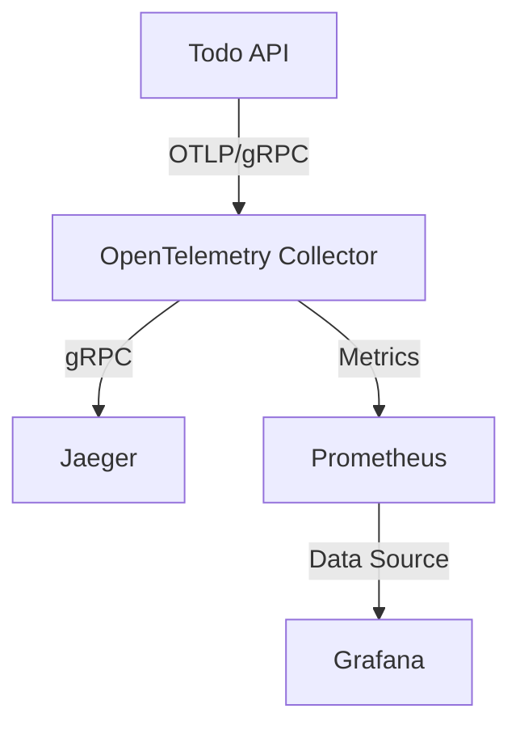
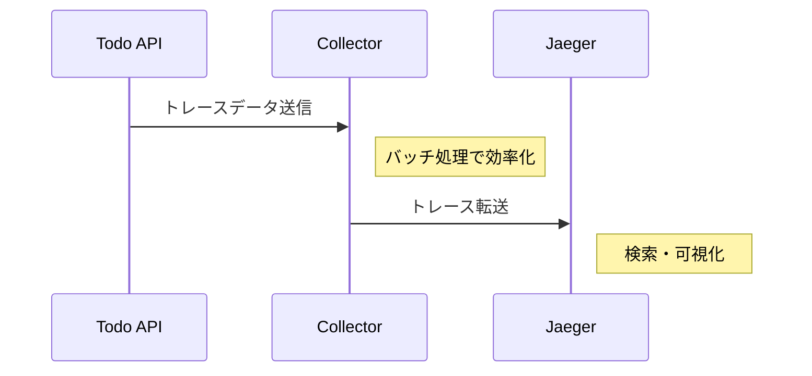
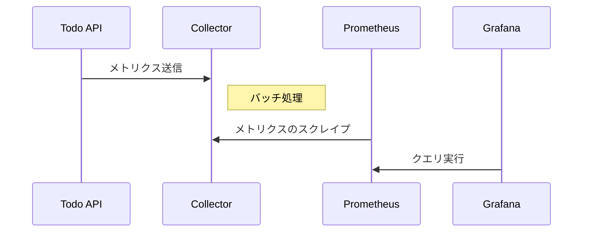

# 監視環境の構築

実際に手を動かしながら、監視環境の構築と各コンポーネントの役割を学んでいきましょう。

## 1. 監視環境の概要と準備

まず必要なディレクトリを作成します：

```bash
cd src/start/docker
mkdir -p grafana/datasources grafana/dashboards
```

これから構築する環境では、以下のコンポーネントが連携して動作します：



> 💡 なぜこの構成なのか？
> - Collector：データの収集・加工を一元管理（複数のバックエンドに転送可能）
> - Jaeger：トレースの可視化に特化（分散トレーシングの確認に最適）
> - Prometheus：メトリクスの収集と保存（時系列データの扱いに強い）
> - Grafana：柔軟な可視化と統合（複数データソースの統合ダッシュボード）

## 2. 環境構築の手順

### 2.1 docker-compose.ymlの作成

以下の内容で`docker-compose.yml`を作成します：

```yaml
services:
  otelcol:
    image: otel/opentelemetry-collector:latest
    volumes:
      - ./otel-collector-config.yaml:/etc/otelcol/config.yaml
    ports:
      - "4317:4317"   # OTLP gRPC - アプリケーションからのデータ受信
      - "4318:4318"   # OTLP HTTP - HTTP経由でのデータ受信
      - "8889:8889"   # Prometheus Exporter - メトリクスの公開
    depends_on:
      - jaeger
  
  jaeger:
    image: jaegertracing/all-in-one:latest
    ports:
      - "16686:16686"   # UI - ブラウザでのトレース確認
      - "4317:4317"     # gRPC - Collectorからのデータ受信
    environment:
      - LOG_LEVEL=debug

  prometheus:
    image: prom/prometheus:latest
    volumes:
      - ./prometheus.yml:/etc/prometheus/prometheus.yml
    ports:
      - "9090:9090"    # UI & API - メトリクス確認とAPI提供

  grafana:
    image: grafana/grafana:latest
    volumes:
      - ./grafana/datasources:/etc/grafana/provisioning/datasources
      - ./grafana/dashboards:/etc/grafana/provisioning/dashboards
    ports:
      - "3000:3000"    # UI - ダッシュボード表示
```

> 💡 ポート番号の意味
> - 4317/4318：OpenTelemetryの標準ポート
> - 16686：Jaegerの標準UIポート
> - 9090：Prometheusの標準ポート
> - 3000：Grafanaの標準ポート

### 2.2 環境の起動と確認

1. Tiltfileの確認：
```python
# docker-compose環境の定義
docker_compose('docker-compose.yml')

# 依存関係の定義
dc_resource('otelcol', deps=['jaeger'])
dc_resource('prometheus')
dc_resource('grafana')
```

2. 環境の起動：
```bash
# 環境の起動
tilt up

# 環境の停止（終了時）
tilt down
```

3. 起動状態の確認（Tilt UI）：
- ブラウザで http://localhost:10350 にアクセス
- 各サービスの状態を確認
- ログをリアルタイムで確認

4. 各UIへのアクセス確認：
- Jaeger UI: http://localhost:16686
- Prometheus: http://localhost:9090
- Grafana: http://localhost:3000

> 💡 Tiltを使用する理由
> - ホットリロード機能により設定変更が即座に反映
> - 依存関係の自動管理
> - ログの集中管理とリアルタイム表示
> - 開発環境の一貫性確保

### 2.3 データの流れを確認

1. トレースデータの流れ：


2. メトリクスデータの流れ：


## 3. トラブルシューティング

### 3.1 起動時の問題

コンテナが起動しない場合は、以下を確認します：

```bash
# ログの確認
docker compose logs -f [service-name]

# ポートの使用状況確認
sudo lsof -i :[port-number]
```

よくある問題：
- ポートの重複：他のプロセスが使用中
- 設定ファイルのマウント失敗：パスや権限の問題
- メモリ不足：リソースの制限を確認

### 3.2 接続の問題

サービス間で接続できない場合：

```bash
# コンテナ間の疎通確認
docker compose exec otelcol wget -q -O- http://jaeger:4317

# 各サービスのログ確認
docker compose logs -f
```

よくある問題：
- DNS解決の失敗：コンテナ名が間違っている
- ポート番号の誤り：設定ファイルを確認
- TLS設定の問題：証明書の設定を確認

## 4. 動作確認のポイント

### 4.1 基本的な確認事項

- [ ] すべてのコンテナが`Up`状態
- [ ] エラーログが出ていない
- [ ] 各UIにアクセス可能
- [ ] コンテナ間で通信可能

### 4.2 詳細な確認

```bash
# メモリ使用量の確認
docker stats

# ネットワーク接続の確認
docker network inspect $(docker compose ps -q)
```

次のセクションでは、この環境上でOpenTelemetry Collectorの詳細な設定を行います。
