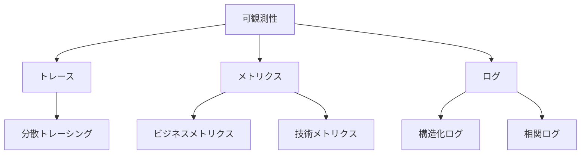
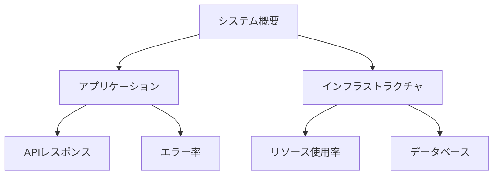

# 可観測性の基本設定

## 概要

この章では、OpenTelemetryを使用した可観測性の基本的な設定について説明します。システムの監視、パフォーマンス分析、トラブルシューティングに必要な基本的な概念と設定方法を学びます。

## 1. 可観測性の基本概念

### 3つの柱



1. トレース
   - リクエストの追跡
   - 処理フローの可視化
   - ボトルネックの特定

2. メトリクス
   - パフォーマンス測定
   - リソース使用率
   - ビジネス指標

3. ログ
   - エラー情報
   - デバッグ情報
   - 監査ログ

## 2. 環境構築

### Docker Composeの設定

```yaml
version: '3.8'
services:
  # OpenTelemetry Collector
  otel-collector:
    image: otel/opentelemetry-collector:latest
    volumes:
      - ./otel-collector-config.yaml:/etc/otelcol/config.yaml
    ports:
      - "4317:4317"   # gRPC
      - "4318:4318"   # HTTP
      - "8889:8889"   # Prometheus Exporter

  # Jaeger
  jaeger:
    image: jaegertracing/all-in-one:latest
    ports:
      - "16686:16686"   # Web UI
      - "4317:4317"     # OTLP/gRPC

  # Prometheus
  prometheus:
    image: prom/prometheus:latest
    volumes:
      - ./prometheus.yml:/etc/prometheus/prometheus.yml
    ports:
      - "9090:9090"

  # Grafana
  grafana:
    image: grafana/grafana:latest
    ports:
      - "3000:3000"
    environment:
      - GF_SECURITY_ADMIN_USER=admin
      - GF_SECURITY_ADMIN_PASSWORD=admin
```

### OpenTelemetry SDKの設定

```csharp
public static class OpenTelemetryExtensions
{
    public static IServiceCollection AddCustomOpenTelemetry(
        this IServiceCollection services,
        IConfiguration configuration)
    {
        services.AddOpenTelemetry()
            .WithTracing(builder =>
            {
                builder
                    .AddSource("TodoApi")
                    .SetResourceBuilder(ResourceBuilder.CreateDefault()
                        .AddService("TodoApi"))
                    .AddAspNetCoreInstrumentation()
                    .AddEntityFrameworkCoreInstrumentation()
                    .AddOtlpExporter();
            })
            .WithMetrics(builder =>
            {
                builder
                    .AddMeter("TodoApi")
                    .AddAspNetCoreInstrumentation()
                    .AddRuntimeInstrumentation()
                    .AddOtlpExporter();
            });

        return services;
    }
}
```

## 3. ベースラインの監視設定

### メトリクスの基本設定

```csharp
public class BaselineMetrics
{
    private readonly Meter _meter;
    private readonly Counter<int> _requestCounter;
    private readonly Histogram<double> _responseTimeHistogram;

    public BaselineMetrics()
    {
        _meter = new Meter("TodoApi.Baseline");
        
        _requestCounter = _meter.CreateCounter<int>(
            "http.requests.total",
            description: "Total number of HTTP requests");

        _responseTimeHistogram = _meter.CreateHistogram<double>(
            "http.response_time",
            unit: "ms",
            description: "HTTP response time");
    }

    public void RecordRequest()
    {
        _requestCounter.Add(1);
    }

    public void RecordResponseTime(double milliseconds)
    {
        _responseTimeHistogram.Record(milliseconds);
    }
}
```

### トレースの基本設定

```csharp
public static class TracingConfig
{
    public static ActivitySource CreateActivitySource()
    {
        return new ActivitySource(
            "TodoApi",
            "1.0.0");
    }

    public static void AddBasicTags(Activity activity)
    {
        activity?.SetTag("service.name", "TodoApi");
        activity?.SetTag("service.version", "1.0.0");
        activity?.SetTag("deployment.environment",
            Environment.GetEnvironmentVariable("ASPNETCORE_ENVIRONMENT"));
    }
}
```

### ログの基本設定

```csharp
public static class LoggingConfig
{
    public static ILoggingBuilder AddBasicLogging(
        this ILoggingBuilder builder)
    {
        return builder
            .AddJsonConsole(options =>
            {
                options.IncludeScopes = true;
                options.TimestampFormat = "yyyy-MM-dd HH:mm:ss";
                options.JsonWriterOptions = new JsonWriterOptions
                {
                    Indented = true
                };
            })
            .AddOpenTelemetry(options =>
            {
                options.IncludeFormattedMessage = true;
                options.IncludeScopes = true;
            });
    }
}
```

## 4. 監視ダッシュボードの設定

### Grafanaダッシュボード



### Prometheus設定

1. メトリクス収集設定
   ```yaml
   global:
     scrape_interval: 15s     # メトリクス収集の間隔

   scrape_configs:
     - job_name: 'otel-collector'
       static_configs:
         - targets: ['otelcol:8889']
       metrics_path: '/metrics'

     - job_name: 'todo-api'
       static_configs:
         - targets: ['todo-api:5000']
       metrics_path: '/metrics/prometheus'
       scheme: 'http'
   ```

2. クエリ例
   ```promql
   # リクエスト率の計算
   rate(todo_app_http_server_duration_milliseconds_count[5m])

   # エラー率の計算
   sum(rate(todo_app_http_server_duration_milliseconds_count{status_code=~"5.."}[5m])) /
   sum(rate(todo_app_http_server_duration_milliseconds_count[5m]))

   # レスポンスタイム（95パーセンタイル）
   histogram_quantile(0.95, 
     rate(todo_app_http_server_duration_milliseconds_bucket[5m]))
   ```

### Grafanaセットアップ

1. データソース設定
   ```yaml
   apiVersion: 1
   
   datasources:
     - name: Prometheus
       type: prometheus
       access: proxy
       url: http://prometheus:9090
       isDefault: true
   ```

## 5. トラブルシューティング

### よくある問題と解決策

1. データが収集されない
   ```plaintext
   確認項目：
   - OpenTelemetry Collectorの起動状態
   - エンドポイントの設定
   - ファイアウォール設定
   ```

2. トレースが表示されない
   ```plaintext
   確認項目：
   - サンプリング設定
   - Jaegerの接続設定
   - アクティビティソースの設定
   ```

3. メトリクスが不正確
   ```plaintext
   確認項目：
   - メーターの登録状態
   - 集計期間の設定
   - エクスポーターの設定
   ```

### ヘルスチェック

```csharp
public class HealthCheck : IHealthCheck
{
    public async Task<HealthCheckResult> CheckHealthAsync(
        HealthCheckContext context,
        CancellationToken cancellationToken = default)
    {
        var isCollectorHealthy = await CheckCollectorHealth();
        var isJaegerHealthy = await CheckJaegerHealth();
        var isPrometheusHealthy = await CheckPrometheusHealth();

        if (!isCollectorHealthy || !isJaegerHealthy || !isPrometheusHealthy)
        {
            return HealthCheckResult.Unhealthy(
                "One or more monitoring components are unhealthy");
        }

        return HealthCheckResult.Healthy();
    }
}
```

## まとめ

1. 基本概念
   - トレース、メトリクス、ログの理解
   - 可観測性の重要性
   - 監視の基本戦略

2. 環境設定
   - Docker Composeの構成
   - OpenTelemetry SDKの設定
   - 監視ツールの統合

3. 基本機能
   - メトリクス収集
   - トレース記録
   - ログ管理

## 次のステップ

次章では、OpenTelemetry Collectorの詳細な設定とエラーハンドリングについて学びます。特に：

- Collectorの高度な設定
- エラー検出と記録
- アラート設定

について詳しく説明します。
