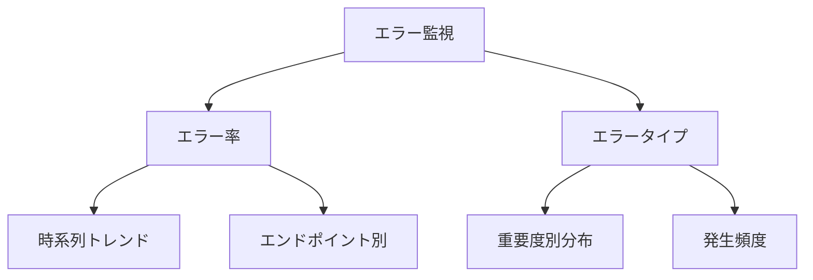

# OpenTelemetry Collectorの設定とエラーハンドリング

## 概要

この章では、OpenTelemetry Collectorの設定とエラーハンドリングの実装について説明します。効果的なエラー検出、ログ記録、アラート設定の方法を学び、システムの信頼性を向上させる方法を理解します。

## 1. OpenTelemetry Collectorの設定

### 基本設定

```yaml
receivers:
  otlp:
    protocols:
      grpc:
        endpoint: 0.0.0.0:4317
      http:
        endpoint: 0.0.0.0:4318

processors:
  batch:
    timeout: 1s
    send_batch_size: 1024
    send_batch_max_size: 2048

exporters:
  debug:
    verbosity: detailed

  otlp/jaeger:
    endpoint: jaeger:4317
    tls:
      insecure: true
  
  prometheus:
    endpoint: 0.0.0.0:8889
    namespace: todo_app

service:
  pipelines:
    traces:
      receivers: [otlp]
      processors: [batch]
      exporters: 
        - otlp/jaeger
        - debug
    metrics:
      receivers: [otlp]
      processors: [batch]
      exporters: [prometheus, debug]
    logs:
      receivers: [otlp]
      processors: [batch]
      exporters: [debug]
```

### Collectorコンポーネントの詳細

1. レシーバー（receivers）
   - OTLP/gRPC: 4317ポートでデータを受信
   - OTLP/HTTP: 4318ポートでデータを受信
   - 受信したデータはパイプラインに従って処理

2. プロセッサー（processors）
   - バッチ処理の設定
     * timeout: 1秒でバッチを強制送信
     * send_batch_size: 通常のバッチサイズ（1024）
     * send_batch_max_size: 最大バッチサイズ（2048）
   - パフォーマンスとリソース使用の最適化

3. エクスポーター（exporters）
   - debug: トラブルシューティング用の詳細ログ出力
   - otlp/jaeger: Jaegerへのトレースデータ転送
   - prometheus: メトリクスデータの公開

4. パイプライン定義
   - トレース: OTLP受信 → バッチ処理 → Jaeger/Debug出力
   - メトリクス: OTLP受信 → バッチ処理 → Prometheus/Debug出力
   - ログ: OTLP受信 → バッチ処理 → Debug出力

### エラー処理の設定

```yaml
processors:
  attributes:
    actions:
      - key: error
        action: upsert
        value: true
      - key: error.type
        action: upsert
        from_attribute: exception.type
      - key: error.message
        action: upsert
        from_attribute: exception.message
```

## 2. エラーハンドリングの実装

### グローバルエラーハンドラー

```csharp
public class GlobalExceptionHandler : IExceptionHandler
{
    private readonly ILogger<GlobalExceptionHandler> _logger;
    private readonly TodoMetrics _metrics;
    private readonly ActivitySource _activitySource;

    public GlobalExceptionHandler(
        ILogger<GlobalExceptionHandler> logger,
        TodoMetrics metrics,
        ActivitySource activitySource)
    {
        _logger = logger;
        _metrics = metrics;
        _activitySource = activitySource;
    }

    public async ValueTask<bool> TryHandleAsync(
        HttpContext context,
        Exception exception,
        CancellationToken cancellationToken)
    {
        using var activity = _activitySource.StartActivity(
            "HandleError",
            ActivityKind.Internal);

        var errorType = exception switch
        {
            ValidationException => "validation_error",
            DbUpdateException => "database_error",
            TimeoutException => "timeout_error",
            _ => "unknown_error"
        };

        // エラー情報の記録
        activity?.SetTag("error", true);
        activity?.SetTag("error.type", errorType);
        activity?.SetTag("error.message", exception.Message);

        // メトリクスの記録
        _metrics.RecordOperationError(
            context.Request.Path,
            errorType);

        // 構造化ログの出力
        _logger.LogError(exception,
            "Error processing request: {Path} {ErrorType} {ErrorMessage}",
            context.Request.Path,
            errorType,
            exception.Message);

        // エラーレスポンスの生成
        var problem = new ProblemDetails
        {
            Status = GetStatusCode(exception),
            Title = GetErrorTitle(errorType),
            Detail = exception.Message,
            Type = $"https://api.example.com/errors/{errorType}"
        };

        await context.Response.WriteAsJsonAsync(
            problem,
            cancellationToken);

        return true;
    }

    private static int GetStatusCode(Exception exception) =>
        exception switch
        {
            ValidationException => StatusCodes.Status400BadRequest,
            NotFoundException => StatusCodes.Status404NotFound,
            TimeoutException => StatusCodes.Status504GatewayTimeout,
            _ => StatusCodes.Status500InternalServerError
        };

    private static string GetErrorTitle(string errorType) =>
        errorType switch
        {
            "validation_error" => "入力値が不正です",
            "database_error" => "データベースエラーが発生しました",
            "timeout_error" => "処理がタイムアウトしました",
            _ => "予期せぬエラーが発生しました"
        };
}
```

### カスタムエラー処理

1. ビジネスロジックのエラー
   ```csharp
   public class TodoService
   {
       public async Task<TodoItem> CreateTodoItem(TodoItem item)
       {
           try
           {
               await ValidateItem(item);
               return await _repository.CreateAsync(item);
           }
           catch (ValidationException ex)
           {
               _logger.LogWarning(ex, "Todo item validation failed");
               throw;
           }
           catch (DbUpdateException ex)
           {
               _logger.LogError(ex, "Failed to create todo item");
               throw;
           }
       }
   }
   ```

2. インフラストラクチャのエラー
   ```csharp
   public class TodoRepository
   {
       public async Task<TodoItem> GetByIdAsync(int id)
       {
           try
           {
               return await _context.TodoItems.FindAsync(id);
           }
           catch (Exception ex) when (IsDatabaseException(ex))
           {
               _logger.LogError(ex, "Database error occurred");
               throw new DatabaseException(
                   "データベースアクセスでエラーが発生しました",
                   ex);
           }
       }
   }
   ```

## 3. エラー監視とアラート

### Prometheusアラートルール

```yaml
groups:
- name: todo_alerts
  rules:
  # エラー率アラート
  - alert: HighErrorRate
    expr: rate(todo_operation_errors_total[5m]) > 0.1
    for: 5m
    labels:
      severity: warning
    annotations:
      summary: "高いエラー率を検出"
      description: "直近5分間のエラー率が10%を超えています"

  # レスポンスタイムアラート
  - alert: HighResponseTime
    expr: histogram_quantile(0.95, rate(todo_api_response_time_bucket[5m])) > 500
    for: 5m
    labels:
      severity: warning
    annotations:
      summary: "高いレスポンスタイムを検出"
      description: "p95レスポンスタイムが500msを超えています"

  # データベースエラーアラート
  - alert: DatabaseErrors
    expr: increase(todo_operation_errors_total{error_type="database_error"}[5m]) > 5
    for: 5m
    labels:
      severity: critical
    annotations:
      summary: "データベースエラーの増加"
      description: "5分間で5件以上のデータベースエラーが発生"
```

### エラー分析のダッシュボード



## 4. エラーリカバリと再試行

### 再試行ポリシー

```csharp
public class RetryPolicy
{
    public static IAsyncPolicy<HttpResponseMessage> GetHttpRetryPolicy()
    {
        return HttpPolicyExtensions
            .HandleTransientHttpError()
            .OrResult(msg => msg.StatusCode == HttpStatusCode.NotFound)
            .WaitAndRetryAsync(3, retryAttempt => 
                TimeSpan.FromSeconds(Math.Pow(2, retryAttempt)));
    }

    public static AsyncRetryPolicy GetDatabaseRetryPolicy()
    {
        return Policy
            .Handle<DbUpdateException>()
            .Or<DbConnectionException>()
            .WaitAndRetryAsync(3, retryAttempt =>
                TimeSpan.FromMilliseconds(100 * Math.Pow(2, retryAttempt)));
    }
}
```

### サーキットブレーカー

```csharp
public class CircuitBreakerPolicy
{
    public static IAsyncPolicy<HttpResponseMessage> GetHttpCircuitBreaker()
    {
        return HttpPolicyExtensions
            .HandleTransientHttpError()
            .CircuitBreakerAsync(
                exceptionsAllowedBeforeBreaking: 5,
                durationOfBreak: TimeSpan.FromSeconds(30));
    }

    public static AsyncCircuitBreakerPolicy GetDatabaseCircuitBreaker()
    {
        return Policy
            .Handle<DbException>()
            .CircuitBreakerAsync(
                exceptionsAllowedBeforeBreaking: 3,
                durationOfBreak: TimeSpan.FromSeconds(15));
    }
}
```

## まとめ

1. エラー検出と記録
   - 構造化ログの活用
   - エラー情報のタグ付け
   - メトリクスの収集

2. アラート設定
   - エラー率の監視
   - レスポンスタイムの監視
   - データベースエラーの監視

3. エラー回復
   - 再試行ポリシー
   - サーキットブレーカー
   - フォールバック戦略

## 次のステップ

次章では、パフォーマンスモニタリングと最適化について学びます。特に：

- パフォーマンスメトリクスの収集
- ボトルネックの特定
- 最適化の実践

について詳しく説明します。
