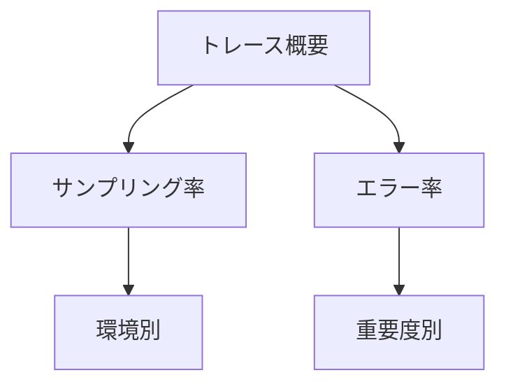

# トレース可視化とサンプリング

## 概要

この章では、Jaegerを使用した分散トレーシングの可視化とサンプリング設定の基本について説明します。トレースの可視化、基本的なサンプリング設定、そしてトレース分析の基礎を学びます。

## 1. トレース可視化の基本

### Jaegerの基本設定

```yaml
services:
  jaeger:
    image: jaegertracing/all-in-one:latest
    ports:
      - "16686:16686"   # Web UI
      - "14250:14250"   # gRPC
```

### トレースの確認方法

1. Jaeger UIへのアクセス
   ```plaintext
   http://localhost:16686
   ```

2. トレース情報の見方
   ```mermaid
   graph TD
    A[HTTP Request] -->|SpanId: 1| B[Controller]
    B -->|SpanId: 2| C[Service]
    C -->|SpanId: 3| D[Database]
    B -->|SpanId: 4| E[External API]
   ```

## 2. 基本的なサンプリング設定

### 環境別サンプリング設定

```csharp
public static class OpenTelemetryConfig
{
    public static IServiceCollection AddCustomTracing(
        this IServiceCollection services,
        IConfiguration configuration)
    {
        return services.AddOpenTelemetry()
            .WithTracing(builder =>
            {
                // 環境に応じたサンプリング率の設定
                var samplingRatio = GetEnvironmentSamplingRatio(configuration);
                builder.AddProcessor(new TodoSamplingProcessor(samplingRatio));
            });
    }

    private static double GetEnvironmentSamplingRatio(IConfiguration configuration)
    {
        var environment = configuration["ASPNETCORE_ENVIRONMENT"];
        return environment switch
        {
            "Development" => 1.0,  // 開発環境は100%
            "Staging" => 0.5,      // ステージング環境は50%
            "Production" => 0.1,   // 本番環境は10%
            _ => 0.1
        };
    }
}
```

## 3. トレース分析の基本

### トレース分析のポイント

1. エンドポイント別の分析
   ```sql
   SELECT
     "http.route" as endpoint,
     COUNT(*) as request_count,
     AVG(duration) as avg_duration
   FROM traces
   GROUP BY "http.route"
   ORDER BY request_count DESC
   LIMIT 10;
   ```

2. エラー分析
   ```sql
   SELECT
     error_type,
     COUNT(*) as error_count
   FROM traces
   WHERE has_error = true
   GROUP BY error_type
   ORDER BY error_count DESC;
   ```

### 基本的なモニタリング



## 4. トラブルシューティング

### よくある問題と解決策

1. トレースが表示されない
   ```plaintext
   確認項目：
   - サンプリング設定
   - Jaegerの接続設定
   - アクティビティソースの設定
   ```

2. トレース情報が不完全
   ```plaintext
   確認項目：
   - SpanのContext伝搬
   - タグの設定
   - Attributeの設定
   ```

3. パフォーマンスの問題
   ```plaintext
   確認項目：
   - サンプリング率の調整
   - バッチ処理の設定
   - Collectorの設定
   ```

## まとめ

1. トレース可視化
   - Jaegerの基本的な使用方法
   - トレース情報の読み方
   - 基本的な分析手法

2. サンプリング設定
   - 環境に応じた基本設定
   - サンプリング率の考え方
   - 基本的な調整方法

3. 運用管理
   - 基本的なモニタリング
   - トラブルシューティング手順
   - 設定の最適化

## 次のステップ

次章では、メトリクスの監視とアラート設定について学びます。特に：

- カスタムメトリクスの実装
- アラートルールの設定
- パフォーマンス分析の手法

について詳しく説明します。
