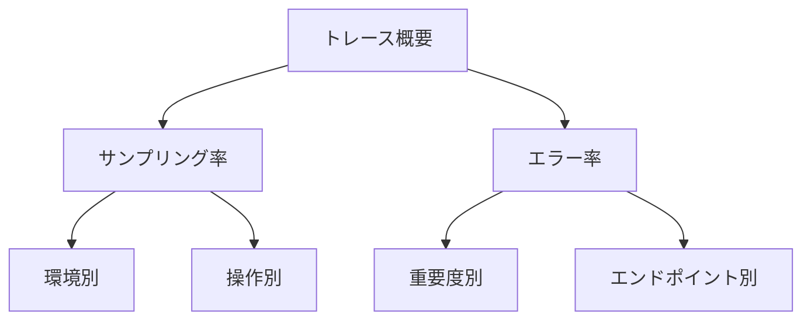

# トレース可視化とサンプリング設定

## 概要

この章では、分散トレーシングの可視化とサンプリング設定の最適化について説明します。Jaegerを使用したトレースの可視化、効果的なサンプリング戦略の実装、そしてパフォーマンスとの両立方法を学びます。

## 1. トレース可視化の基本

### Jaegerの基本設定

```yaml
services:
  jaeger:
    image: jaegertracing/all-in-one:latest
    ports:
      - "16686:16686"   # Web UI
      - "14250:14250"   # gRPC
```

### トレースの確認方法

1. Jaeger UIへのアクセス
   ```plaintext
   http://localhost:16686
   ```

2. トレース情報の見方
   ```mermaid
   graph TD
    A[HTTP Request] -->|SpanId: 1| B[Controller]
    B -->|SpanId: 2| C[Service]
    C -->|SpanId: 3| D[Database]
    B -->|SpanId: 4| E[External API]
   ```

## 2. サンプリング設定の最適化

### カスタムサンプリングプロセッサの実装

```csharp
public class TodoSamplingProcessor : BaseProcessor<Activity>
{
    private readonly double _defaultSamplingRatio;
    private readonly HashSet<string> _importantEndpoints;

    public TodoSamplingProcessor(double defaultSamplingRatio = 0.1)
    {
        _defaultSamplingRatio = defaultSamplingRatio;
        _importantEndpoints = new HashSet<string>
        {
            "/api/TodoItems/Create",
            "/api/TodoItems/Delete"
        };
    }

    public override void OnStart(Activity activity)
    {
        if (activity == null) return;

        // 重要なエンドポイントは常にサンプリング
        if (IsImportantEndpoint(activity))
        {
            activity.ActivityTraceFlags |= ActivityTraceFlags.Recorded;
            return;
        }

        // エラー発生時は常にサンプリング
        if (HasError(activity))
        {
            activity.ActivityTraceFlags |= ActivityTraceFlags.Recorded;
            return;
        }

        // その他は設定された比率でサンプリング
        if (Random.Shared.NextDouble() < _defaultSamplingRatio)
        {
            activity.ActivityTraceFlags |= ActivityTraceFlags.Recorded;
        }
        else
        {
            activity.ActivityTraceFlags &= ~ActivityTraceFlags.Recorded;
        }
    }
}
```

### サンプリング戦略の設計

1. 環境別サンプリング設定
   ```csharp
   public static class OpenTelemetryConfig
   {
       public static IServiceCollection AddCustomTracing(
           this IServiceCollection services,
           IConfiguration configuration)
       {
           return services.AddOpenTelemetry()
               .WithTracing(builder =>
               {
                   // 環境に応じたサンプリング率の設定
                   var samplingRatio = GetEnvironmentSamplingRatio(configuration);
                   builder.AddProcessor(new TodoSamplingProcessor(samplingRatio));
               });
       }

       private static double GetEnvironmentSamplingRatio(IConfiguration configuration)
       {
           var environment = configuration["ASPNETCORE_ENVIRONMENT"];
           return environment switch
           {
               "Development" => 1.0,  // 開発環境は100%
               "Staging" => 0.5,      // ステージング環境は50%
               "Production" => 0.1,   // 本番環境は10%
               _ => 0.1
           };
       }
   }
   ```

2. 重要度に基づくサンプリング
   ```csharp
   public static class SamplingPolicy
   {
       // 常にサンプリングする重要な操作を定義
       public static readonly HashSet<string> CriticalOperations = new()
       {
           "Create",
           "Delete",
           "Error"
       };

       // 重要度に応じたサンプリング率の定義
       public static readonly Dictionary<string, double> OperationRates = new()
       {
           ["High"] = 1.0,    // 重要度高：100%
           ["Medium"] = 0.5,  // 重要度中：50%
           ["Low"] = 0.1      // 重要度低：10%
       };
   }
   ```

### パフォーマンスの最適化

1. サンプリング判定の最適化
   ```csharp
   public class OptimizedSamplingProcessor : BaseProcessor<Activity>
   {
       private readonly ConcurrentDictionary<string, bool> _endpointCache;
       
       public override void OnStart(Activity activity)
       {
           // キャッシュを使用してエンドポイントの判定を高速化
           var endpoint = activity.GetTagItem("http.route") as string;
           if (string.IsNullOrEmpty(endpoint)) return;

           var shouldSample = _endpointCache.GetOrAdd(endpoint, path =>
           {
               // 初回のみ詳細な判定を実行
               return IsImportantEndpoint(path) || 
                      ShouldSampleByPriority(path);
           });

           if (shouldSample)
           {
               activity.ActivityTraceFlags |= ActivityTraceFlags.Recorded;
           }
       }
   }
   ```

2. メモリ使用量の最適化
   ```csharp
   public class MemoryOptimizedSampler
   {
       private readonly int _maxCacheSize;
       private readonly ConcurrentDictionary<string, bool> _cache;

       public MemoryOptimizedSampler(int maxCacheSize = 1000)
       {
           _maxCacheSize = maxCacheSize;
           _cache = new ConcurrentDictionary<string, bool>();
       }

       public void TrimCache()
       {
           // キャッシュサイズが上限を超えた場合、古いエントリを削除
           while (_cache.Count > _maxCacheSize)
           {
               _cache.TryRemove(
                   _cache.OrderBy(x => x.Value).First().Key,
                   out _);
           }
       }
   }
   ```

## 3. トレース分析とモニタリング

### トレース分析のベストプラクティス

1. エンドポイント別の分析
   ```sql
   SELECT
     "http.route" as endpoint,
     COUNT(*) as request_count,
     AVG(duration) as avg_duration,
     MAX(duration) as max_duration
   FROM traces
   GROUP BY "http.route"
   ORDER BY request_count DESC
   LIMIT 10;
   ```

2. エラー分析
   ```sql
   SELECT
     error_type,
     COUNT(*) as error_count,
     AVG(duration) as avg_duration
   FROM traces
   WHERE has_error = true
   GROUP BY error_type
   ORDER BY error_count DESC;
   ```

### モニタリングダッシュボード



## 4. トラブルシューティング

### よくある問題と解決策

1. サンプリング率が低すぎる
   ```plaintext
   症状：重要なトレースが記録されていない
   対策：
   - 重要な操作のリストを見直す
   - サンプリング率の閾値を調整する
   - エラー時の強制サンプリングを確認
   ```

2. パフォーマンス影響が大きい
   ```plaintext
   症状：サンプリング処理がレイテンシに影響
   対策：
   - キャッシュの活用
   - 早期リターンの実装
   - 判定ロジックの軽量化
   ```

3. メモリ使用量の増加
   ```plaintext
   症状：サンプリングプロセッサのメモリ使用量が増加
   対策：
   - キャッシュサイズの制限
   - 定期的なキャッシュクリーンアップ
   - メモリ使用量の監視
   ```

## まとめ

1. トレース可視化
   - Jaegerの効果的な利用
   - トレース情報の解析方法
   - 可視化ダッシュボードの活用

2. サンプリング設定
   - 環境に応じた適切な設定
   - 重要度に基づく戦略
   - パフォーマンスとの両立

3. 運用管理
   - 継続的なモニタリング
   - トラブルシューティング手順
   - パフォーマンス最適化

## 次のステップ

次章では、メトリクスの監視とアラート設定について学んでいきます。特に：

- カスタムメトリクスの実装
- アラートルールの設定
- パフォーマンス分析の手法

について詳しく説明します。
