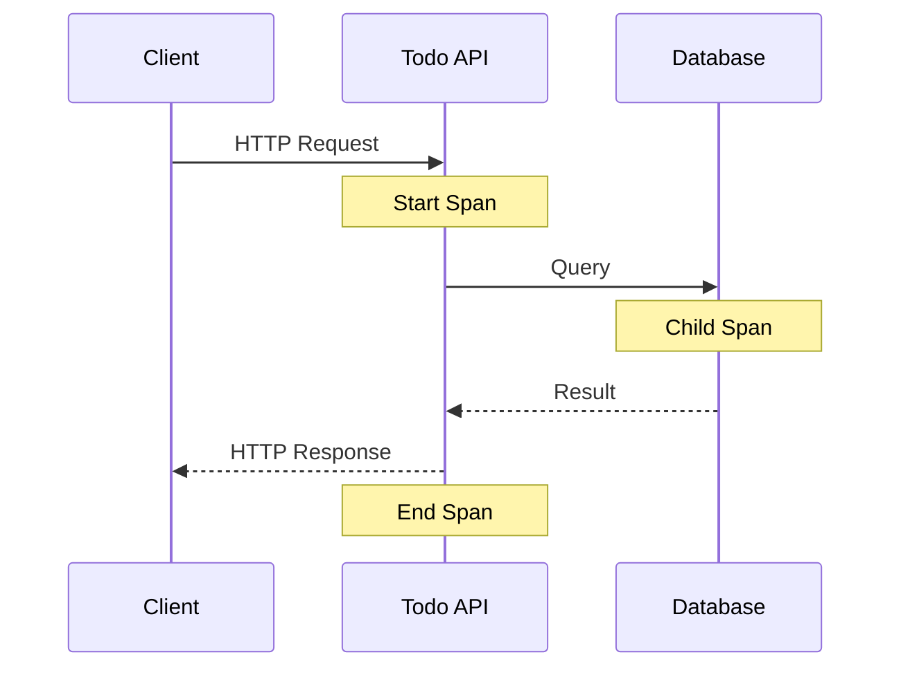

# トレース可視化の実装

## 概要

この章では、Jaegerを使用してOpenTelemetryのトレースを可視化する方法について説明します。TodoアプリケーションのカスタムサンプリングとJaeger UIでの分析方法を解説します。

## トレースの基本概念

### 分散トレーシング



### スパンの構造

1. ルートスパン
   - HTTPリクエストの開始から終了
   - 全体の処理時間を表す

2. 子スパン
   - データベース操作
   - 外部APIコール
   - ビジネスロジックの処理

## サンプリング戦略

Todoアプリケーションでは、以下のサンプリング戦略を実装しています：

```csharp
public class TodoSamplingProcessor : BaseProcessor<Activity>
{
    private readonly double _defaultSamplingRatio;
    private readonly HashSet<string> _importantEndpoints;

    public TodoSamplingProcessor(double defaultSamplingRatio = 0.1)
    {
        _defaultSamplingRatio = defaultSamplingRatio;
        _importantEndpoints = new HashSet<string>
        {
            "/api/TodoItems/Create",
            "/api/TodoItems/Delete"
        };
    }

    public override void OnStart(Activity activity)
    {
        // 重要なエンドポイントは常にサンプリング
        if (IsImportantEndpoint(activity))
        {
            activity.ActivityTraceFlags |= ActivityTraceFlags.Recorded;
            return;
        }

        // エラー発生時は常にサンプリング
        if (HasError(activity))
        {
            activity.ActivityTraceFlags |= ActivityTraceFlags.Recorded;
            return;
        }

        // その他は設定された比率でサンプリング
        if (Random.Shared.NextDouble() < _defaultSamplingRatio)
        {
            activity.ActivityTraceFlags |= ActivityTraceFlags.Recorded;
        }
    }
}
```

### サンプリングルール

1. 重要なエンドポイント（100%サンプリング）
   - Todo作成操作
   - Todo削除操作

2. エラー発生時（100%サンプリング）
   - 4xxエラー
   - 5xxエラー

3. その他のエンドポイント
   - 開発環境: 100%サンプリング
   - 本番環境: 10%サンプリング

## Jaeger UIの使用方法

### トレースの検索

1. サービスの選択
   
   - Service: `TodoApi`を選択
   - Operation: 特定の操作を選択（任意）

2. 検索条件の設定
   - Tags: エラーやカスタムタグで検索
   - Lookback: 検索期間の設定
   - Limit: 表示件数の制限

### トレースの分析

1. タイムライン表示
   ```
   ├─── HTTP GET /api/TodoItems
   │    ├─── DB Query
   │    └─── Data Processing
   ```

2. スパンの詳細表示
   - Duration: 処理時間
   - Tags: 
     - http.method
     - http.status_code
     - error
     - todo.id
     - todo.title

3. エラー分析
   - エラースパンの特定
   - エラー情報の確認
   - トレース全体のコンテキスト

## トレース分析のベストプラクティス

### 1. パフォーマンス分析

1. レイテンシの特定

```mermaid
gantt
    title API Request Timeline
    dateFormat X
    axisFormat %L
    HTTP Request   :0, 500
    DB Query      :100, 300
    Processing    :300, 400
```


2. ボトルネックの発見
   - 長時間のスパンを特定
   - 異常な待機時間の検出
   - 頻繁な再試行の確認

### 2. エラー分析

1. エラーパターンの特定
   - エラーの種類
   - 発生頻度
   - 影響範囲

2. トラブルシューティング
   - エラー発生箇所の特定
   - エラーコンテキストの確認
   - 関連スパンの分析

### 3. システム動作の把握

1. リクエストフロー
   - コンポーネント間の通信
   - 依存関係の可視化
   - ボトルネックの特定

2. 異常検知
   - 通常パターンからの逸脱
   - エラー率の上昇
   - レイテンシの増加

## トラブルシューティング

### よくある問題と解決方法

1. トレースが表示されない
   - サンプリング設定の確認
   - Collectorの接続確認
   - アプリケーションの設定確認

2. トレースが不完全
   - Context Propagationの確認
   - サービス間の接続確認
   - タイムアウト設定の確認

3. パフォーマンス問題
   - サンプリング率の調整
   - バッチ設定の最適化
   - リソース使用量の確認

## 次のステップ

[メトリクス監視の実装](04_metrics_monitoring.md)で、PrometheusとGrafanaを使用したメトリクスの可視化方法を学びます。
