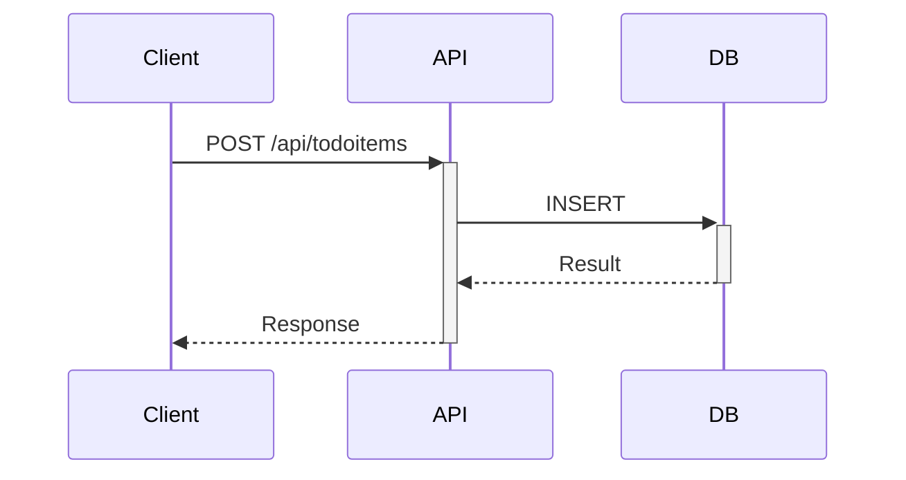
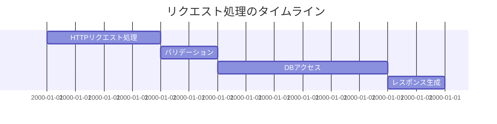
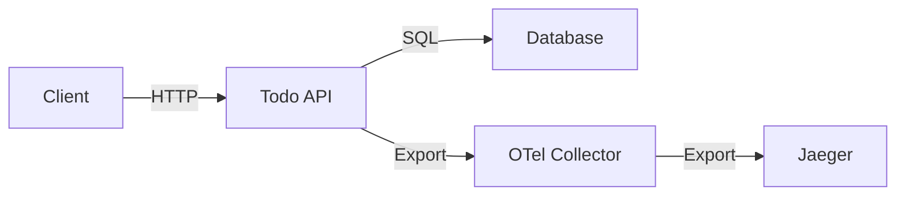

# Jaegerによるトレース可視化

実際にトレースを生成・確認しながら、分散トレーシングについて学んでいきましょう。

## 1. トレースの生成

まず、アプリケーションにリクエストを送信してトレースを生成します：

```bash
# Todoアイテムの作成
curl -X POST http://localhost:5000/api/todoitems \
  -H "Content-Type: application/json" \
  -d '{"name": "OpenTelemetryを学ぶ", "isComplete": false}'

# 全アイテムの取得
curl http://localhost:5000/api/todoitems
```

> 💡 トレースとは？
> - 1つのリクエストの処理過程を追跡したもの
> - 複数のSpan（処理単位）で構成
> - 処理時間や依存関係を可視化

## 2. Jaeger UIでの確認

1. ブラウザで http://localhost:16686 を開く
2. 左メニューで以下を選択：
   - Service: `todo-api`
   - Operation: `POST /api/todoitems`
   - Tags: 必要に応じて検索条件を追加



> 💡 なぜトレース可視化が必要か？
> - パフォーマンス問題の特定
> - エラーの伝播状況の確認
> - サービス間の依存関係の理解

## 3. トレース分析の実践

### 3.1 正常系トレースの確認

1. 成功パターンの生成：
```bash
# 複数のTodoアイテムを作成
for i in {1..5}; do
  curl -X POST http://localhost:5000/api/todoitems \
    -H "Content-Type: application/json" \
    -d "{\"name\": \"タスク$i\", \"isComplete\": false}"
done
```

2. Jaeger UIで確認：
- [ ] 全体の処理時間
- [ ] 各Spanの所要時間
- [ ] Spanの親子関係
- [ ] タグ情報

### 3.2 エラーケースの確認

1. エラーパターンの生成：
```bash
# 存在しないIDのTodoを取得
curl http://localhost:5000/api/todoitems/999

# 不正なJSONでリクエスト
curl -X POST http://localhost:5000/api/todoitems \
  -H "Content-Type: application/json" \
  -d "{invalid json}"
```

2. エラートレースの分析：
- [ ] エラーフラグの確認
- [ ] エラーメッセージの内容
- [ ] スタックトレースの確認

## 4. 詳細分析の手法

### 4.1 Timeline View（タイムライン表示）

1. 処理時間の分布：


2. 確認ポイント：
- Spanの実行順序
- 処理の重なり
- 待機時間の発生箇所

### 4.2 Dependencies View（依存関係表示）

サービス間の呼び出し関係：


## 5. パフォーマンス分析

### 5.1 ボトルネックの特定

1. 時間のかかる処理の特定：
```bash
# 大量のリクエストを送信
for i in {1..20}; do
  curl http://localhost:5000/api/todoitems &
done
wait
```

2. Jaeger UIで確認：
- 処理時間の長いSpan
- 同時実行時の遅延
- リソース競合の兆候

### 5.2 改善のヒント

- バッチ処理の検討
- キャッシュの活用
- 非同期処理の導入

## 6. トラブルシューティングガイド

### 6.1 問題の切り分け方

1. 症状の確認
- [ ] トレースが全く表示されない
- [ ] トレース情報が不完全
- [ ] Spanが欠落している
- [ ] Context伝搬が機能していない

2. ログの確認
```bash
# 全体のログ確認
docker compose logs -f

# サービス別のログ確認
docker compose logs -f jaeger
docker compose logs -f otelcol
docker compose logs -f todo-api

# エラーの確認
docker compose logs | grep -i error
docker compose logs | grep -i span
```

3. 設定の確認
```bash
# OpenTelemetry環境変数
docker compose exec todo-api env | grep OTEL

# Jaeger UI状態確認
curl http://localhost:16686/api/services

# Collector設定確認
docker compose exec otelcol cat /etc/otelcol/config.yaml
```

### 6.2 よくある問題と解決策

1. トレースが表示されない
- 原因：
  * サンプリング設定の問題
  * Collectorへの接続エラー
  * Jaegerへのエクスポート失敗
- 解決策：
  * サンプリング率の確認と調整
  * Collector接続設定の確認
  * Jaegerの状態確認

2. トレース情報が不完全
- 原因：
  * Context伝搬の問題
  * 設定の不備
  * SDKの問題
- 解決策：
  * HTTPヘッダーの確認
  * Instrumentationの設定確認
  * SDKバージョンの確認

3. パフォーマンスの問題
- 原因：
  * データ量が多すぎる
  * サンプリング率が高すぎる
  * リソース不足
- 解決策：
  * サンプリング戦略の見直し
  * バッファサイズの調整
  * リソースの増強

### 6.3 診断コマンド集

1. トレース生成の確認
```bash
# テストリクエストの送信
curl -v -X POST http://localhost:5000/api/todoitems \
  -H "Content-Type: application/json" \
  -d '{"name": "テスト", "isComplete": false}'

# Context伝搬の確認
curl -v http://localhost:5000/api/todoitems
```

2. ログ確認コマンド
```bash
# Jaegerのログ
docker compose logs -f jaeger

# Spanの詳細確認
docker compose logs | grep -i "span"

# Context伝搬の確認
docker compose logs | grep -i "traceparent"
```

3. 接続確認コマンド
```bash
# Jaeger UI接続確認
curl -s http://localhost:16686/api/services

# Collectorからの接続確認
docker compose exec otelcol nc -zv jaeger 4317

# ネットワーク状態の確認
docker network inspect $(docker compose ps -q)
```

> 💡 効率的なトラブルシューティングのポイント
> - テストリクエストで問題を再現
> - トレースの流れを段階的に確認
> - Context伝搬を確実に追跡
> - サービス間の接続を順に確認

次のセクションでは、PrometheusとGrafanaを使用したメトリクス監視を行います。
