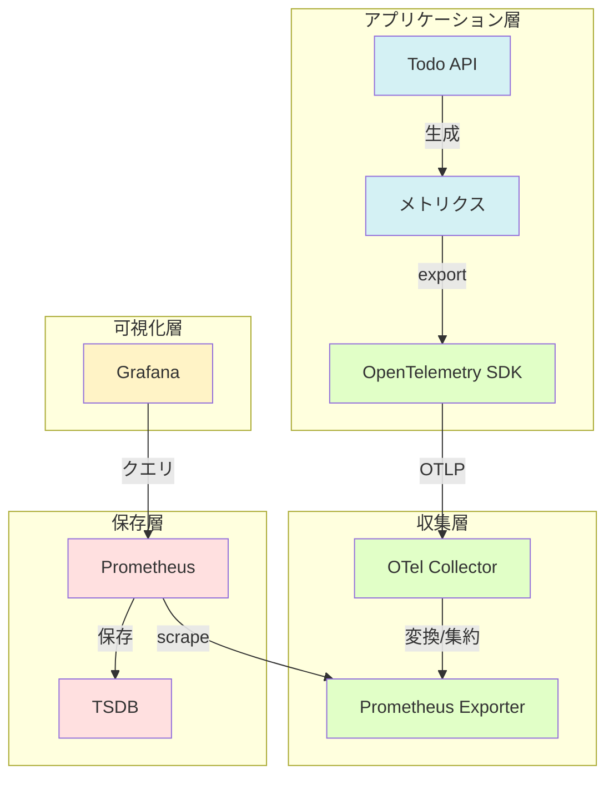
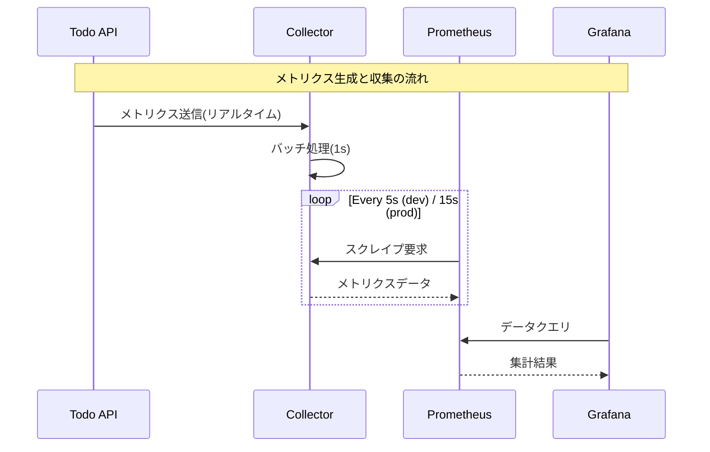

# メトリクス監視の設定

実際にメトリクスを収集・可視化しながら、監視の仕組みについて学んでいきましょう。

## 1. Prometheusの設定

まず、メトリクス収集の設定を行います：

### 1.1 prometheus.ymlの作成

以下の内容で`prometheus.yml`を作成します：

```yaml
global:
  scrape_interval: 5s    # メトリクス収集の間隔

scrape_configs:
  - job_name: 'otel-collector'
    static_configs:
      - targets: ['otelcol:8889']
    metrics_path: '/metrics'

  - job_name: 'todo-api'
    static_configs:
      - targets: ['todo-api:5000']
    metrics_path: '/metrics/prometheus'
    scheme: 'http'
```

> 💡 収集間隔（scrape_interval）について
> - 開発環境: 5秒
>   * 素早いフィードバック
>   * 問題の早期発見
>   * デバッグのしやすさ
> 
> - 本番環境: 15秒
>   * サーバーリソースの節約
>   * ストレージ使用量の最適化
>   * 長期トレンド分析に十分な粒度
>
> - 設定時の考慮点：
>   * メトリクス変化の速さ
>   * システムへの負荷
>   * ストレージ容量
>   * アラート応答性
>
> 💡 アドバイス：
> - 開発中は5秒で詳細に観察
> - 本番移行前に15秒に変更
> - 急激な変化の監視が重要な場合は調整

### 1.2 設定の適用

```bash
# Prometheusの再起動
docker compose restart prometheus

# 設定の確認
curl http://localhost:9090/api/v1/status/config
```

## 2. メトリクスの収集と流れ

### 2.1 メトリクスの流れ



> 💡 ポイント
> - アプリケーション層：メトリクスの生成
> - 収集層：データの集約と変換
> - 保存層：時系列データの保存
> - 可視化層：データの分析と表示

### 2.2 時間軸での流れ



> 💡 タイミングのポイント
> - メトリクス生成：イベント発生時
> - Collector集約：1秒間隔
> - スクレイプ：環境により5秒/15秒
> - データ保持：デフォルト15日間

### 2.3 サンプルデータの生成

```bash
# 正常系リクエスト
for i in {1..10}; do
  curl -X POST http://localhost:5000/api/todoitems \
    -H "Content-Type: application/json" \
    -d "{\"name\": \"タスク$i\", \"isComplete\": false}"
done

# エラー系リクエスト
curl http://localhost:5000/api/todoitems/999
```

### 2.2 Prometheusでの確認

1. ブラウザで http://localhost:9090 を開く
2. 以下のクエリを試してみましょう：

```promql
# リクエスト総数
http_server_requests_total

# 1分あたりのリクエスト数
rate(http_server_requests_total[1m])

# エラー率
sum(rate(http_server_errors_total[5m])) / 
sum(rate(http_server_requests_total[5m])) * 100
```

> 💡 なぜrate()を使うのか？
> - Counter型は単調増加のため、差分を見る必要がある
> - rate()で単位時間あたりの変化量を計算
> - 傾向の把握が容易になる

## 3. Grafanaでの可視化

### 3.1 データソースの追加

1. http://localhost:3000 にアクセス（初期認証情報：admin/admin）
2. Configuration → Data sources → Add data source
3. Prometheusを選択し、以下を設定：
   - URL: `http://prometheus:9090`
   - Access: Server

### 3.2 ダッシュボードの作成

1. 新規ダッシュボード作成
2. パネルの追加：

```bash
# リクエストレート
rate(http_server_requests_total[5m])

# レスポンスタイム
histogram_quantile(0.95, 
  rate(http_request_duration_seconds_bucket[5m]))

# エラー率
sum(rate(http_server_errors_total[5m])) / 
sum(rate(http_server_requests_total[5m])) * 100
```

> 💡 パネルの選び方
> - 時系列データ → グラフ
> - 現在値 → ゲージ
> - 分布 → ヒストグラム
> - 関係性 → ヒートマップ

### 3.3 アラートの設定

1. アラートルールの作成：
```yaml
# エラー率アラート
- alert: HighErrorRate
  expr: sum(rate(http_server_errors_total[5m])) / 
       sum(rate(http_server_requests_total[5m])) * 100 > 5
  for: 5m
  labels:
    severity: critical
  annotations:
    summary: "エラー率が高い"
```

2. 通知チャンネルの設定：
   - Alerting → Notification channels
   - Email, Slack等の設定

## 4. パフォーマンス分析

### 4.1 負荷テスト実行

```bash
# 連続リクエスト生成
for i in {1..100}; do
  curl http://localhost:5000/api/todoitems &
done
wait
```

### 4.2 メトリクス確認

1. レスポンスタイムの分布：
```promql
histogram_quantile(0.95, 
  rate(http_request_duration_seconds_bucket[5m]))
```

2. リソース使用状況：
```promql
# メモリ使用率
process_resident_memory_bytes{job="todo-api"}

# CPU使用率
rate(process_cpu_seconds_total{job="todo-api"}[5m])
```

## 5. トラブルシューティングガイド

### 5.1 問題の切り分け方

1. 症状の確認
- [ ] メトリクスが収集されていない
- [ ] データが古い/更新されない
- [ ] グラフが表示されない
- [ ] アラートが発報しない

2. ログの確認
```bash
# 全体のログ確認
docker compose logs -f

# サービス別のログ確認
docker compose logs -f prometheus
docker compose logs -f grafana
docker compose logs -f todo-api

# エラーの確認
docker compose logs | grep -i error
docker compose logs | grep -i failed
```

3. 設定の確認
```bash
# Prometheus設定
curl http://localhost:9090/api/v1/status/config

# スクレイプターゲット
curl http://localhost:9090/api/v1/targets

# メトリクスの確認
curl http://localhost:5000/metrics/prometheus
```

### 5.2 よくある問題と解決策

1. メトリクスが収集されない
- 原因：
  * スクレイプ設定の誤り
  * ネットワーク接続の問題
  * アプリケーションの設定ミス
- 解決策：
  * prometheus.ymlの確認
  * ネットワーク疎通の確認
  * エンドポイントの確認

2. データの更新が遅い
- 原因：
  * scrape_intervalが長すぎる
  * リソース不足
  * ネットワーク遅延
- 解決策：
  * 収集間隔の調整
  * リソースの増強
  * バッチ設定の最適化

3. グラフ表示の問題
- 原因：
  * クエリの誤り
  * 時間範囲の設定
  * データソース接続
- 解決策：
  * PromQLの確認
  * 時間範囲の調整
  * データソース設定の確認

### 5.3 診断コマンド集

1. 状態確認コマンド
```bash
# Prometheusのターゲット状態
curl -s http://localhost:9090/api/v1/targets | jq .

# メトリクス一覧の取得
curl -s http://localhost:9090/api/v1/label/__name__/values | jq .

# 特定のメトリクスの確認
curl -s 'http://localhost:9090/api/v1/query?query=up'
```

2. ログ確認コマンド
```bash
# 直近のエラーログ
docker compose logs --tail=100 | grep -i error

# リアルタイムログ監視
docker compose logs -f | grep -i metrics

# スクレイプログの確認
docker compose logs -f prometheus | grep scrape
```

3. 接続確認コマンド
```bash
# Prometheus -> アプリケーション
docker compose exec prometheus wget -q -O- todo-api:5000/metrics/prometheus

# Grafana -> Prometheus
docker compose exec grafana wget -q -O- prometheus:9090/api/v1/status

# ネットワーク状態の確認
docker network inspect $(docker compose ps -q)
```

> 💡 効率的なトラブルシューティングのポイント
> - 問題を切り分けて段階的に確認
> - ログとメトリクスを組み合わせて分析
> - 設定とネットワークの両面から確認
> - 問題箇所を特定したら、1つずつ対処

## 6. 発展的な使用法

### 6.1 カスタムメトリクス

1. ビジネスメトリクス：
```promql
# Todoの完了率
sum(todo_items_completed) / 
sum(todo_items_total) * 100
```

2. パフォーマンスメトリクス：
```promql
# DBクエリ時間
histogram_quantile(0.95, 
  rate(database_query_duration_seconds_bucket[5m]))
```

### 6.2 相関分析

```promql
# エラー率とレスポンスタイムの相関
rate(http_server_errors_total[5m])
/
rate(http_request_duration_seconds_count[5m])
```

次のステップでは、これらの監視設定を実際のアプリケーションに適用していきます。
