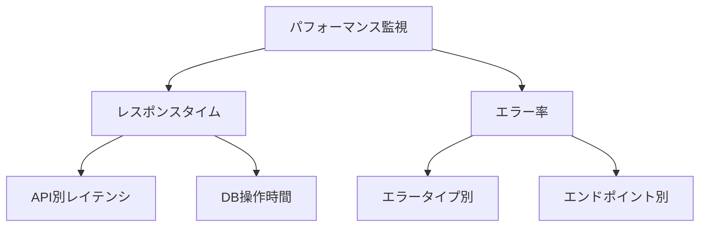

# メトリクス監視とアラート設定

## 概要

この章では、OpenTelemetryを使用したメトリクス監視とアラート設定について説明します。カスタムメトリクスの実装、パフォーマンスメトリクスの収集、効果的なアラート設定の方法を学びます。

## 1. カスタムメトリクスの実装

### メトリクスの設計

```csharp
public class TodoMetrics
{
    private readonly Counter<int> _todosCreatedCounter;
    private readonly Counter<int> _todosCompletedCounter;
    private readonly UpDownCounter<int> _activeTodosCounter;
    private readonly Histogram<double> _todoCompletionTimeHistogram;
    private readonly Counter<int> _todoOperationErrorCounter;
    private readonly Histogram<double> _apiResponseTimeHistogram;

    public TodoMetrics()
    {
        var meter = new Meter("TodoApi");
        
        // 基本的なメトリクス
        _todosCreatedCounter = meter.CreateCounter<int>(
            "todo_items_created_total",
            description: "Total number of created todo items");
        _todosCompletedCounter = meter.CreateCounter<int>(
            "todo_items_completed_total",
            description: "Total number of completed todo items");
        _activeTodosCounter = meter.CreateUpDownCounter<int>(
            "todo_items_active",
            description: "Current number of active todo items");
        
        // パフォーマンスメトリクス
        _todoCompletionTimeHistogram = meter.CreateHistogram<double>(
            "todo_completion_time_milliseconds",
            unit: "ms",
            description: "Todo item completion time");
        _apiResponseTimeHistogram = meter.CreateHistogram<double>(
            "todo_app_http_server_duration_milliseconds",
            unit: "ms",
            description: "HTTP server response time");
        
        // エラーメトリクス
        _todoOperationErrorCounter = meter.CreateCounter<int>(
            "todo_operation_errors_total",
            description: "Total number of operation errors");
    }
}
```

### メトリクスの収集

1. ビジネスメトリクス
   ```csharp
   public void TodoCompleted(DateTime createdAt, string priority = "normal")
   {
       _todosCompletedCounter.Add(1, new KeyValuePair<string, object>[]
       {
           new("priority", priority)
       });
       _activeTodosCounter.Add(-1);
       
       var completionTime = (DateTime.UtcNow - createdAt).TotalMilliseconds;
       _todoCompletionTimeHistogram.Record(completionTime);
   }
   ```

2. パフォーマンスメトリクス
   ```csharp
   public void RecordApiResponseTime(double milliseconds, string operation)
   {
       _apiResponseTimeHistogram.Record(milliseconds, 
           new KeyValuePair<string, object>[] 
           {
               new("operation", operation),
               new("http_route", operation)
           });
   }
   ```

3. エラーメトリクス
   ```csharp
   public void RecordOperationError(string operation, string errorType)
   {
       _todoOperationErrorCounter.Add(1, 
           new KeyValuePair<string, object>[] 
           {
               new("operation", operation),
               new("error_type", errorType)
           });
   }
   ```

## 2. アラート設定

### Prometheusアラートルール

```yaml
groups:
- name: todo_alerts
  rules:
  # エラー率アラート
  - alert: HighErrorRate
    expr: |
      sum(rate(todo_app_http_server_duration_milliseconds_count{status_code=~"5.."}[5m])) /
      sum(rate(todo_app_http_server_duration_milliseconds_count[5m])) > 0.1
    for: 5m
    labels:
      severity: warning
    annotations:
      summary: "高いエラー率を検出"
      description: "直近5分間のエラー率が10%を超えています"

  # レスポンスタイムアラート
  - alert: HighResponseTime
    expr: histogram_quantile(0.95, rate(todo_app_http_server_duration_milliseconds_bucket[5m])) > 500
    for: 5m
    labels:
      severity: warning
    annotations:
      summary: "高いレスポンスタイムを検出"
      description: "p95レスポンスタイムが500msを超えています"

  # データベースエラーアラート
  - alert: DatabaseErrors
    expr: increase(todo_operation_errors_total{error_type="database_error"}[5m]) > 5
    for: 5m
    labels:
      severity: critical
    annotations:
      summary: "データベースエラーの増加"
      description: "5分間で5件以上のデータベースエラーが発生"
```

### モニタリングダッシュボード



## 3. パフォーマンス分析

### レスポンスタイムの監視

1. p95/p99レイテンシの計測
   ```promql
   histogram_quantile(0.95, 
     sum(rate(todo_app_http_server_duration_milliseconds_bucket[5m])) by (le, http_route))
   ```

2. レイテンシのトレンド分析
   ```promql
   rate(todo_app_http_server_duration_milliseconds_sum[1h]) / 
   rate(todo_app_http_server_duration_milliseconds_count[1h])
   ```

### リソース使用率の監視

1. メモリ使用率
   ```promql
   process_working_set_bytes{job="todo-api"}
   ```

2. GCメトリクス
   ```promql
   dotnet_total_memory_bytes{job="todo-api"}
   ```

## 4. パフォーマンス最適化のヒント

### データベース最適化

1. クエリパフォーマンス
   - インデックスの適切な使用
   - N+1問題の回避
   - クエリの実行計画確認

2. 接続管理
   - コネクションプールの設定
   - トランザクション範囲の最適化
   - デッドロック監視

### APIパフォーマンス

1. キャッシュ戦略
   - レスポンスキャッシュの活用
   - データキャッシュの設定
   - 分散キャッシュの検討

2. 非同期処理
   - 長時間処理の非同期化
   - バッチ処理の最適化
   - バックグラウンドジョブの活用

## まとめ

1. メトリクス実装
   - カスタムメトリクスの設計
   - 効果的なメトリクス収集
   - メトリクスの種類と使い分け

2. アラート設定
   - アラートルールの設計
   - 重要度の設定
   - 通知設定の最適化

3. パフォーマンス分析
   - レスポンスタイムの監視
   - リソース使用率の分析
   - 最適化の実践

## 次のステップ

- カスタムエクスポーターの実装
- 大規模システムでのメトリクス戦略
- アラート設定の高度な活用
- パフォーマンスチューニングの深掘り
