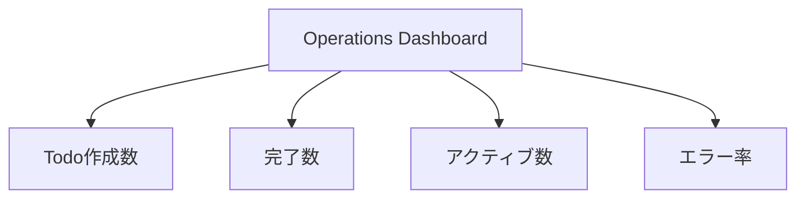

# メトリクス監視の実装

## 概要

この章では、TodoアプリケーションのメトリクスをPrometheusで収集し、Grafanaで可視化する方法について説明します。カスタムメトリクスの実装からダッシュボードの作成まで、段階的に解説します。

## メトリクスの実装

Todoアプリケーションでは、以下のカスタムメトリクスを実装しています：

```csharp
public class TodoMetrics
{
    private readonly Counter<int> _todosCreatedCounter;
    private readonly Counter<int> _todosCompletedCounter;
    private readonly UpDownCounter<int> _activeTodosCounter;
    private readonly Histogram<double> _todoCompletionTimeHistogram;
    private readonly Counter<int> _todoOperationErrorCounter;
    private readonly Histogram<double> _apiResponseTimeHistogram;
    private readonly Counter<int> _todoOperationCounter;

    public TodoMetrics()
    {
        _meter = new Meter("TodoApi");
        
        // カウンター系メトリクス
        _todosCreatedCounter = _meter.CreateCounter<int>(
            "todo.created",
            description: "Number of todo items created");

        _todosCompletedCounter = _meter.CreateCounter<int>(
            "todo.completed",
            description: "Number of todo items marked as complete");

        // UpDownカウンター
        _activeTodosCounter = _meter.CreateUpDownCounter<int>(
            "todo.active",
            description: "Number of active (incomplete) todo items");

        // ヒストグラム
        _todoCompletionTimeHistogram = _meter.CreateHistogram<double>(
            "todo.completion_time",
            unit: "ms",
            description: "Time taken to complete todo items");
    }
}
```

### メトリクスの種類

1. カウンター系
   - todo.created: 作成されたTodoの数
   - todo.completed: 完了したTodoの数
   - todo.operation.errors: エラーの発生数
   - todo.operation.count: 操作の実行数

2. UpDownカウンター
   - todo.active: アクティブなTodoの数

3. ヒストグラム
   - todo.completion_time: Todo完了までの時間
   - todo.api.response_time: APIレスポンス時間

## Prometheusの設定

### スクレイピング設定

```yaml
global:
  scrape_interval: 15s
  evaluation_interval: 15s

scrape_configs:
  - job_name: 'otel-collector'
    static_configs:
      - targets: ['otel-collector:8889']

  - job_name: 'todo-api'
    static_configs:
      - targets: ['todo-api:5000']
```

### メトリクスの確認

1. Prometheus UI（http://localhost:9090）にアクセス
2. Graph画面でメトリクスを検索
3. PromQLクエリの例：
   ```
   # 直近1時間のTodo作成数
   rate(todo_created_total[1h])

   # アクティブなTodoの数
   todo_active

   # 90パーセンタイルの完了時間
   histogram_quantile(0.9, rate(todo_completion_time_bucket[5m]))
   ```

## Grafanaダッシュボード

### データソースの設定

1. Grafana（http://localhost:3001）にアクセス
2. Configuration > Data Sources
3. Add data source
4. Prometheusを選択
   - URL: http://prometheus:9090
   - Access: Server（default）

### ダッシュボードの作成

#### 1. オペレーション概要



```json
{
  "panels": [
    {
      "title": "Todo作成数（時間毎）",
      "type": "graph",
      "targets": [
        {
          "expr": "rate(todo_created_total[1h])"
        }
      ]
    },
    {
      "title": "アクティブなTodo数",
      "type": "gauge",
      "targets": [
        {
          "expr": "todo_active"
        }
      ]
    }
  ]
}
```

#### 2. パフォーマンスダッシュボード

1. レスポンスタイム
   ```json
   {
     "title": "APIレスポンスタイム",
     "type": "heatmap",
     "targets": [
       {
         "expr": "rate(todo_api_response_time_bucket[5m])"
       }
     ]
   }
   ```

2. 完了時間分布
   ```json
   {
     "title": "Todo完了時間分布",
     "type": "histogram",
     "targets": [
       {
         "expr": "todo_completion_time_bucket"
       }
     ]
   }
   ```

### アラート設定

1. エラー率アラート
```yaml
alert: HighErrorRate
expr: rate(todo_operation_errors_total[5m]) > 0.1
for: 5m
labels:
  severity: warning
annotations:
  summary: High error rate detected
  description: Error rate is above 10% for the last 5 minutes
```

2. レイテンシアラート
```yaml
alert: HighLatency
expr: histogram_quantile(0.95, rate(todo_api_response_time_bucket[5m])) > 500
for: 5m
labels:
  severity: warning
annotations:
  summary: High API latency detected
  description: 95th percentile latency is above 500ms
```

## ダッシュボードのベストプラクティス

### 1. 構造化

1. Overview
   - 主要KPIの表示
   - 異常値の即時検出
   - トレンドの可視化

2. 詳細ビュー
   - 操作種別ごとの統計
   - エラー分析
   - パフォーマンス指標

### 2. 可視化の選択

1. 時系列データ
   - Graph: トレンド表示
   - Heatmap: 分布の変化

2. 現在値
   - Gauge: 範囲内の値
   - Stat: 単一の値

3. 複合データ
   - Table: 詳細な値
   - Bar chart: 比較

## トラブルシューティング

### よくある問題と解決方法

1. メトリクスが収集されない
   - スクレイピング設定の確認
   - エンドポイントの接続確認
   - メトリクス名の確認

2. グラフが表示されない
   - PromQLクエリの確認
   - データ範囲の確認
   - 単位の確認

3. アラートが機能しない
   - 評価間隔の確認
   - 条件式の確認
   - 通知設定の確認

## まとめ

1. メトリクスの設計
   - ビジネス指標の選定
   - 技術指標の選定
   - 適切なメトリクス種別の選択

2. 監視の設計
   - データの収集
   - 可視化の工夫
   - アラート設定

3. 運用の準備
   - ドキュメント作成
   - チーム内での共有
   - 継続的な改善
