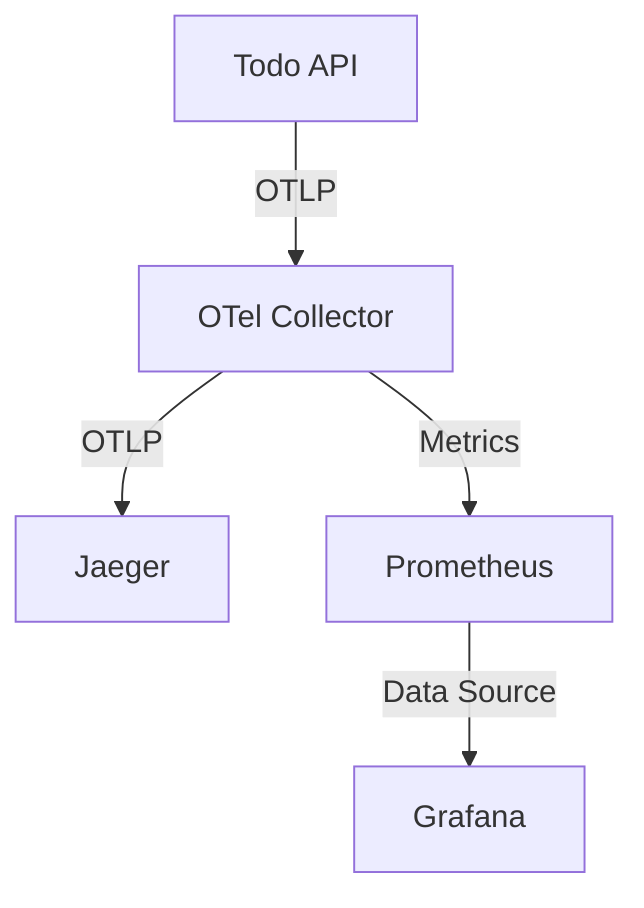

# 第3章: 観測環境の構築

## 概要

この章では、OpenTelemetryで収集したデータを可視化するための環境を構築します。Docker Composeを使用して、OpenTelemetry Collector、Jaeger、Prometheus、Grafanaを連携させ、トレースとメトリクスの可視化を実現します。

## 学習目標

1. 観測環境のアーキテクチャを理解する
   - 各コンポーネントの役割
   - データの流れ
   - 連携の仕組み

2. OpenTelemetry Collectorの設定方法を学ぶ
   - 受信設定（Receivers）
   - 処理設定（Processors）
   - エクスポート設定（Exporters）
   - パイプライン設定

3. トレース可視化環境の構築
   - Jaegerの設定
   - UI操作方法
   - トレース分析手法

4. メトリクス監視環境の構築
   - Prometheusの設定
   - Grafanaのダッシュボード作成
   - アラート設定

## 前提条件

- Docker Composeが利用可能であること
- 第2章のOpenTelemetry実装が完了していること

## 章の構成

1. [観測環境のセットアップ](01_observability_setup.md)
   - Docker Compose環境の解説
   - コンポーネント間の連携
   - 基本設定の確認

2. [OpenTelemetry Collectorの設定](02_collector_config.md)
   - 受信設定
   - 処理設定
   - エクスポート設定
   - パイプライン設定

3. [トレース可視化の実装](03_trace_visualization.md)
   - Jaegerの基本設定
   - UI操作方法
   - トレース分析手法
   - サンプリング結果の確認

4. [メトリクス監視の実装](04_metrics_monitoring.md)
   - Prometheusの設定
   - Grafanaの設定
   - ダッシュボード作成
   - アラート設定

## システム構成

## 期待される成果

1. 分散トレーシング
   - リクエストの追跡
   - エラーの検出
   - パフォーマンスの分析

2. メトリクス監視
   - リソース使用率の監視
   - アプリケーションメトリクス
   - カスタムメトリクス

3. 可視化とアラート
   - トレース可視化
   - メトリクスダッシュボード
   - アラート通知

## 注意事項

- セキュリティ設定は学習用に最小限としています
- 本番環境では適切なセキュリティ設定が必要です
- リソース使用量に注意してください
