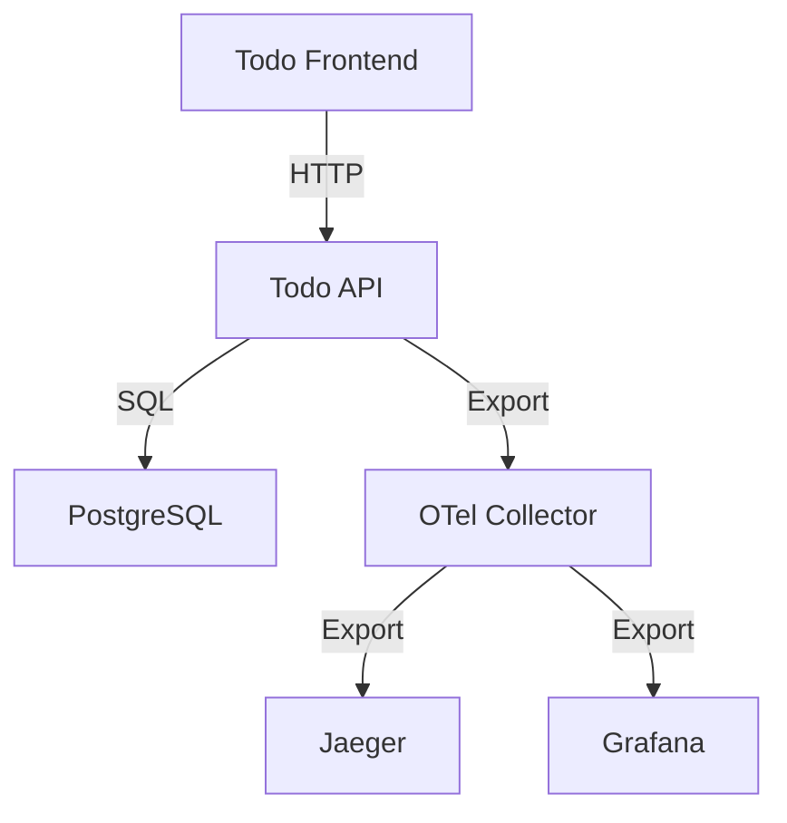

# システムパターン

## アーキテクチャ概要

## アーキテクチャ設計方針

### 1. レイヤードアーキテクチャ

1. プレゼンテーション層

   - React フロントエンド
   - RESTful API エンドポイント

2. ビジネスロジック層

   - Todo アイテム管理
   - OpenTelemetry 計装

3. データアクセス層
   - Entity Framework Core
   - リポジトリパターン

### 2. クリーンアーキテクチャ

1. エンティティ層

   - Todo モデル
   - ビジネスルール

2. ユースケース層

   - Todo CRUD 操作
   - トレーシング統合

3. インターフェースアダプター層

   - コントローラー
   - データベースアクセス
   - 外部サービス連携

4. フレームワーク・ドライバー層
   - ASP.NET Core
   - PostgreSQL
   - OpenTelemetry SDK

## 技術的判断基準

### 1. アプリケーション設計

1. シンプルさの重視

   - 最小限の機能セット
   - 明確な責任分離
   - 理解しやすいコード構造

2. テスタビリティ

   - 依存性注入の活用
   - モックフレンドリーな設計
   - テスト容易性の確保

3. メンテナンス性
   - 一貫したコーディング規約
   - 適切なドキュメント
   - 疎結合な設計

### 2. 可観測性設計

1. トレーシング戦略

   - 環境別サンプリング設定
     - 開発環境: 100%サンプリング
     - 本番環境: 10%サンプリング
   - 重要操作の優先サンプリング
     - Create操作: 常時サンプリング
     - Delete操作: 常時サンプリング
   - エラー時の自動サンプリング
     - 4xx/5xxエラー発生時
     - データ整合性エラー時

2. メトリクス設計

   - アプリケーションメトリクス
     - APIレスポンスタイムの分布
     - エラー発生率の追跡
     - 操作種別ごとのカウント
   - ビジネスメトリクス
     - Todo作成数/完了数
     - アクティブなTodo数
     - 優先度別の操作統計
   - パフォーマンスメトリクス
     - データベース操作時間
     - メモリ/CPU使用率
     - HTTPリクエスト数

3. エラー監視設計
   - エラー種別の分類
     - HTTPステータスコード
     - データベースエラー
     - ビジネスロジックエラー
   - コンテキスト情報の収集
     - エラー発生時のスタック
     - 関連するリクエスト情報
     - ユーザー操作情報
   - アラート条件の設定
     - エラー率の閾値
     - レスポンスタイムの閾値
     - リソース使用率の閾値

## システム連携パターン

### 1. フロントエンド・バックエンド連携

- RESTful API による通信
- HTTP/HTTPS プロトコル
- JSON データフォーマット

### 2. データベース連携

- Entity Framework Core
- コードファーストアプローチ
- マイグレーション管理

### 3. モニタリング連携

- OpenTelemetry Protocol (OTLP)
- Collector による集中管理
- 各バックエンドへのエクスポート

## エラーハンドリングパターン

1. アプリケーションエラー

   - グローバルエラーハンドリング
   - 構造化されたエラーレスポンス
   - エラーログ記録

2. インフラストラクチャエラー

   - リトライパターン
   - サーキットブレーカー
   - フォールバック戦略

3. 監視エラー
   - デッドレター処理
   - バッファリング
   - エラー通知

## デプロイメントパターン

### ローカル開発環境

1. Dev Container

   - 統合開発環境
   - 依存関係管理
   - ツール設定

## アプリ実行環境

2. Docker Compose

   - サービス定義
   - 環境変数管理
   - ボリューム設定
